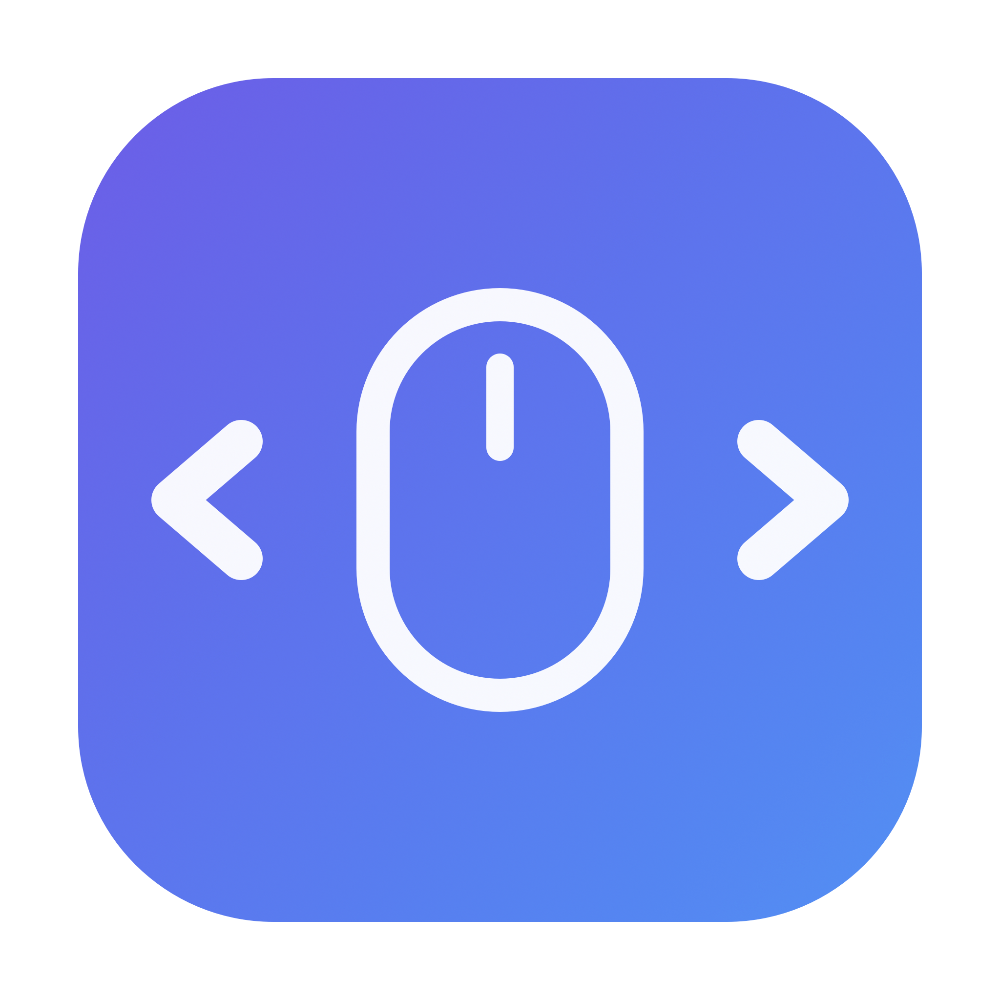

<div align="center">
  
  <h1>Mac Utilities</h1>
  <p>A single lightweight macOS background app that bundles handy mouse & desktop tweaks — with <b>one</b> permission for all of them.</p>
</div>

---

## Features

| Feature | What it does |
|---|---|
| **Desktop Switcher** | Switch between desktops with **Ctrl + Scroll Wheel** — perfect for a traditional PC mouse. |
| **ScrollFix** | Independent scroll directions: the mouse scrolls traditionally while the trackpad stays natural. (Keep **Natural Scrolling ON** in System Settings.) |

Everything runs inside **one** background app (`MacUtilities.app`). Adding a new feature later needs **no new permission** — it's all one process.

## Why one app?

The old version shipped two separate binaries, each needing its own Accessibility grant, and the services could get stuck in a permission-prompt loop. The current design fixes both:

- ✅ **One permission** — a single **Accessibility** grant (no Input Monitoring needed).
- ✅ **No prompt loop** — the app asks once, then waits quietly and activates the moment you grant access. No restart, no "stop the service first" dance.
- ✅ **No sudo** — installs to `~/Applications`, not `/usr/local/bin`.
- ✅ **Code-signed bundle** with a stable identifier, so the permission survives rebuilds.

## Install

Requires the Swift toolchain (`xcode-select --install`).

```bash
git clone https://github.com/halitince7/mac-utilities.git
cd mac-utilities
bash scripts/build-app.sh
```

This compiles, signs, installs `MacUtilities.app` to `~/Applications`, and starts it as a login agent.

**Final step — grant one permission:**

> **System Settings → Privacy & Security → Accessibility → enable `MacUtilities`**

It starts working immediately after you flip the switch. It also launches automatically on every login.

## Usage

- **Switch desktops:** hold **Ctrl** and scroll the mouse wheel up / down.
- **Mouse scroll direction:** with macOS *Natural Scrolling* ON, your mouse now scrolls the traditional way while the trackpad stays natural.

## Uninstall

```bash
launchctl unload ~/Library/LaunchAgents/com.mathatinlabs.macutilities.plist
rm -f ~/Library/LaunchAgents/com.mathatinlabs.macutilities.plist
rm -rf ~/Applications/MacUtilities.app
```

Then remove `MacUtilities` from **System Settings → Privacy & Security → Accessibility**.

## Project layout

```
src/mac-utilities.swift    # the unified daemon (all features live here)
scripts/build-app.sh       # build + sign + install
assets/                    # icon source (make-icon.swift) + AppIcon.icns
```

## Roadmap / distribution

This kind of utility relies on a global event tap + Accessibility, which the **Mac App Store sandbox does not allow** — so distribution is via a **Developer ID–signed, notarized** `.app`/DMG (like Rectangle, BetterTouchTool, etc.), not the App Store. The build script already has the signing hook ready for a Developer ID identity.

## License

Open source — free to use, modify, and distribute.
